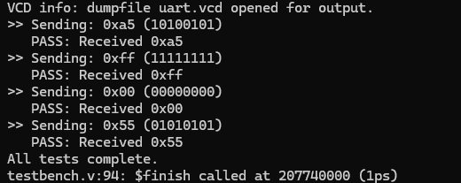
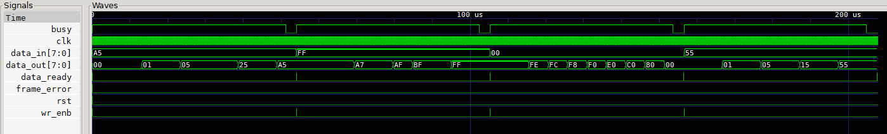
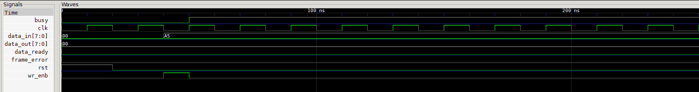

# UART Communication System in Verilog

## Table of Contents
1. [What is UART?](#1-what-is-uart)
2. [What is Baud Rate?](#2-what-is-baud-rate)
3. [Baud Rate, Clock Frequency, and Number of Cycles](#3-baud-rate-clock-frequency-and-number-of-cycles)
4. [How the Transmitter and Receiver Communicate](#4-how-the-transmitter-and-receiver-communicate)
5. [Module Breakdown](#5-module-breakdown)
6. [State Tables](#6-state-tables)
7. [How to Run the Simulation](#7-how-to-run-the-simulation)
8. [Results and Waveforms](#8-results-and-waveforms)

---

## 1. What is UART?

**UART** stands for **Universal Asynchronous Receiver/Transmitter**. It is one of the oldest and most widely used serial communication protocols in digital electronics.

The key word is **asynchronous** — unlike SPI or I2C, UART does not use a shared clock signal between the sender and receiver. Instead, both devices agree on a communication speed (baud rate) beforehand, and each uses its own internal clock to time the transmission.

### Key Characteristics

| Property | Value |
|---|---|
| Number of wires | 2 (TX and RX) |
| Direction | Full duplex (send and receive simultaneously) |
| Clock | None shared — each side uses its own |
| Data format | 1 start bit + data bits + optional parity + 1 stop bit |
| Common use cases | Microcontrollers, GPS modules, Bluetooth modules, debug consoles |

### The UART Frame

Every byte transmitted over UART is wrapped in a **frame**:

```
  Idle    Start   D0    D1    D2    D3    D4    D5    D6    D7   Stop   Idle
────┐      ┌─────┐     ┌─────────────────┐     ┌─────┐      ┌────────
   │      │     │     │                 │     │     │      │
   └──────┘     └─────┘                 └─────┘     └──────┘
   HIGH    LOW   LSB                               MSB    HIGH
```

- **Idle** — line sits HIGH when no data is being sent
- **Start bit** — line pulled LOW to signal the beginning of a frame
- **Data bits** — 5 to 9 bits of actual data, sent LSB (least significant bit) first
- **Parity bit** (optional) — error detection bit
- **Stop bit** — line pulled HIGH to signal the end of the frame

---

## 2. What is Baud Rate?

**Baud rate** is the number of **symbols transmitted per second** over a communication channel. In UART, each symbol is one bit, so baud rate equals bits per second.

It is named after **Émile Baudot**, a French engineer who pioneered telegraph communication.

### Common Baud Rates

| Baud Rate | Bits per second | Time per bit |
|---|---|---|
| 9600 | 9,600 | 104.17 µs |
| 19200 | 19,200 | 52.08 µs |
| 57600 | 57,600 | 17.36 µs |
| 115200 | 115,200 | 8.68 µs |

### Why 9600?

9600 baud is the most common default because it is:
- Slow enough to be reliable over long cables and noisy environments
- Fast enough for human-readable data like sensor readings or debug output
- Universally supported by virtually every UART-capable device

### What Happens if Baud Rates Don't Match?

If the transmitter sends at 9600 baud but the receiver expects 115200, the receiver will sample bits at the wrong times and receive completely garbled data. This is one of the most common bugs when setting up serial communication.

---

## 3. Baud Rate, Clock Frequency, and Number of Cycles

This is the most important relationship to understand when implementing UART in hardware.

### The Core Formula

```
Cycles per bit = Clock Frequency / Baud Rate
```

### Example: 50 MHz Clock, 9600 Baud

```
Cycles per bit = 50,000,000 / 9,600 = 5,208 cycles
```

This means the transmitter must hold each bit on the line for exactly **5,208 clock cycles** before moving to the next bit. A counter counts from 0 to 5208, and the state machine only advances when the counter resets.

### The TX Counter

```verilog
if (tx_counter == 5208)
    tx_counter <= 0;       // Reset → pulse tx_en HIGH for one cycle
else
    tx_counter <= tx_counter + 1;
```

`tx_en` goes HIGH for exactly one clock cycle every 5208 cycles. The transmitter state machine only moves forward when `tx_en` is HIGH.

### The RX Counter — 16x Oversampling

The receiver uses a much faster tick — it samples **16 times per baud period**:

```
RX cycles = Cycles per bit / 16 = 5208 / 16 ≈ 325 cycles
```

```verilog
if (rx_counter == 325)
    rx_counter <= 0;       // Reset → pulse rx_en HIGH
```

**Why 16x?** When the receiver detects a start bit, it doesn't know exactly when the bit began — it could be anywhere in those 5208 cycles. By sampling 16 times per bit, it can:

1. Detect the falling edge of the start bit quickly
2. Wait 8 samples (~half a bit period) to reach the **middle** of the bit
3. Sample at the centre where the signal is most stable and least likely to be corrupted by edge transitions

```
Bit period (5208 cycles):
┌────────────────────────────────────────┐
│← 8 samples →│← 8 samples →           │
│              ↑                         │
│         Sample here                    │
│         (middle of bit)                │
└────────────────────────────────────────┘
```

### For Simulation (Scaled Down)

Running at real timing in simulation takes millions of cycles and times out. For testing, we scale the counters down while keeping the same ratio:

| | Real Timing | Simulation |
|---|---|---|
| TX counter limit | 5208 | 15 |
| RX counter limit | 325 | 7 |
| Ratio (TX/RX) | ~16x | ~2x |
| Logic correctness | ✓ | ✓ |
| Real timing | ✓ | ✗ (doesn't matter for simulation) |

---

## 4. How the Transmitter and Receiver Communicate

### Physical Connection

```
  ┌─────────────────┐                    ┌─────────────────┐
  │   TRANSMITTER   │                    │    RECEIVER     │
  │                 │                    │                 │
  │  data_in[7:0] ──┤                    ├── data_out[7:0] │
  │  wr_enb ────────┤                    ├── data_ready    │
  │                 │     tx_line        │                 │
  │            TX ──┼────────────────────┼── RX           │
  │                 │                    ├── frame_error   │
  │  busy ──────────┤                    │                 │
  └─────────────────┘                    └─────────────────┘
         │                                       │
         └───────────── clk, rst ────────────────┘
```

In this project, `tx_line` is a wire in the top-level module that connects the TX output of the transmitter directly to the RX input of the receiver. This is called a **loopback** configuration and is standard practice for testing.

### Step-by-Step Communication Flow

```
Step 1: User asserts wr_enb HIGH and places data on data_in[7:0]
        Transmitter latches the data and moves to start_state

Step 2: Transmitter pulls tx_line LOW (start bit) for one baud period

Step 3: Transmitter sends bits D0 through D7, one per baud period, LSB first
        Each bit is held stable for exactly 5208 clock cycles

Step 4: Transmitter pulls tx_line HIGH (stop bit) and returns to idle

Step 5: Receiver detects the falling edge on rx (start bit)
        It waits half a baud period to centre itself, then begins sampling

Step 6: Receiver samples bits D0 through D7 at the centre of each baud period

Step 7: Receiver checks stop bit — if HIGH, data_ready pulses HIGH
        If stop bit is LOW, frame_error is asserted instead

Step 8: data_out[7:0] holds the received byte, which should match data_in[7:0]
```

### Signal Timing Diagram

```
wr_enb   ──┐ ┌──────────────────────────────────────────────────────────────
           └─┘
data_in  ──[ 0xA5 ]──────────────────────────────────────────────────────────

tx_line  ────┐ ┌──┐ ┌──┐ ┌──┐ ┌──┐ ┌──┐ ┌──┐ ┌──────────────────────────
             │S│D0│ │D2│ │D4│ │D6│ │  │ │  │ │  stop
             └─┘  └─┘  └─┘  └─┘  └─┘  └─┘  └─┘

busy     ──────────────────────────────────────────────┐ ┌──────────────────
                                                       └─┘
data_rdy ──────────────────────────────────────────────┐ ┌──────────────────
                                                       └─┘  (pulse)
data_out ──────────────────────────────────────────────[ 0xA5 ]─────────────
```

---

## 5. Module Breakdown

### baud_rate_generator

Generates two enable pulses from the system clock:
- `tx_en` — fires once every 5208 cycles (one baud period) for the transmitter
- `rx_en` — fires once every 325 cycles (1/16 baud period) for the receiver

```
Inputs:  clk
Outputs: tx_en, rx_en
```

### transmitter

A 4-state FSM that takes parallel 8-bit data and sends it serially over `tx`.

```
Inputs:  clk, rst, wr_enb, tx_en, data_in[7:0]
Outputs: tx, busy
```

### receiver

A 4-state FSM that samples the incoming serial line and reconstructs the parallel byte.

```
Inputs:  clk, rst, rx_en, rx
Outputs: data_out[7:0], data_ready, frame_error
```

### uart_top

Top-level wrapper that instantiates all three modules and connects them together.

```
Inputs:  clk, rst, wr_enb, data_in[7:0]
Outputs: data_out[7:0], data_ready, frame_error, busy
```

---

## 6. State Tables

### Transmitter State Machine

| Current State | Condition | Next State | TX Output | Action |
|---|---|---|---|---|
| `idle_state (00)` | `wr_enb = 0` | `idle_state` | HIGH | Wait for data |
| `idle_state (00)` | `wr_enb = 1` | `start_state` | HIGH | Latch data_in |
| `start_state (01)` | `tx_en = 1` | `data_state` | **LOW** | Send start bit |
| `data_state (10)` | `tx_en = 1`, `index < 7` | `data_state` | `data[index]` | Send next bit |
| `data_state (10)` | `tx_en = 1`, `index = 7` | `stop_state` | `data[7]` | Send last bit |
| `stop_state (11)` | `tx_en = 1` | `idle_state` | **HIGH** | Send stop bit |
| `any` | `rst = 1` | `idle_state` | HIGH | Reset |

### Transmitter State Encoding

```
idle_state  = 2'b00
start_state = 2'b01
data_state  = 2'b10
stop_state  = 2'b11
```

### Transmitter State Diagram

```
         rst
          │
          ▼
    ┌──────────┐   wr_enb=1    ┌───────────┐
    │   IDLE   │──────────────▶│   START   │
    │  tx=HIGH │               │  tx=LOW   │
    └──────────┘               └───────────┘
          ▲                          │ tx_en
          │                          ▼
          │                    ┌───────────┐
          │        tx_en       │   DATA    │
          │   index=7          │tx=data[i] │
          │◀───────────────────│  i: 0→7  │
          │                    └───────────┘
          │
    ┌──────────┐
    │   STOP   │
    │  tx=HIGH │
    └──────────┘
```

---

### Receiver State Machine

| Current State | Condition | Next State | Action |
|---|---|---|---|
| `idle_state (00)` | `rx = 1` | `idle_state` | Wait, line is idle |
| `idle_state (00)` | `rx = 0` | `start_state` | Start bit detected |
| `start_state (01)` | `rx = 0` | `data_state` | Valid start, begin sampling |
| `start_state (01)` | `rx = 1` | `idle_state` | False start, discard |
| `data_state (10)` | `rx_en`, `index < 7` | `data_state` | Sample bit, increment index |
| `data_state (10)` | `rx_en`, `index = 7` | `stop_state` | Sample last bit |
| `stop_state (11)` | `rx = 1` | `idle_state` | Valid frame, assert `data_ready` |
| `stop_state (11)` | `rx = 0` | `idle_state` | Framing error, assert `frame_error` |
| `any` | `rst = 1` | `idle_state` | Reset |

### Receiver State Encoding

```
idle_state  = 2'b00
start_state = 2'b01
data_state  = 2'b10
stop_state  = 2'b11
```

### Receiver State Diagram

```
         rst
          │
          ▼
    ┌──────────┐   rx=0        ┌───────────┐
    │   IDLE   │──────────────▶│   START   │
    │ wait LOW │               │  verify   │
    └──────────┘               └───────────┘
          ▲                       │      │
          │              rx=0     │      │ rx=1 (false start)
          │                       ▼      └──────────┐
          │                 ┌───────────┐            │
          │    index=7      │   DATA    │            │
          │◀────────────────│sample bit │            │
          │                 │  i: 0→7  │            │
          │                 └───────────┘            │
          │                                          │
    ┌──────────┐                                     │
    │   STOP   │◀────────────────────────────────────┘
    │ check rx │
    └──────────┘
     rx=1 → data_ready=1
     rx=0 → frame_error=1
```

---

## 7. How to Run the Simulation

### Option A — Locally with Icarus Verilog

**Install Icarus Verilog:**
- Windows: http://bleyer.org/icarus/
- Mac: `brew install icarus-verilog`
- Linux: `sudo apt install iverilog`

**Install GTKWave** (waveform viewer):
- Windows/Mac: https://gtkwave.sourceforge.net/
- Linux: `sudo apt install gtkwave`

**Run the simulation:**

```bash
# 1. Compile
iverilog -Wall -g2012 -o uart_sim design.v testbench.v

# 2. Simulate
vvp uart_sim

# 3. View waveforms
gtkwave uart.vcd
```

**Expected terminal output:**
```
VCD info: dumpfile uart.vcd opened for output.
>> Sending: 0xa5 (10100101)
   PASS: Received 0xa5 correctly
>> Sending: 0xff (11111111)
   PASS: Received 0xff correctly
>> Sending: 0x00 (00000000)
   PASS: Received 0x00 correctly
>> Sending: 0x55 (01010101)
   PASS: Received 0x55 correctly
All tests complete.
```

### Option B — EDA Playground (browser, no install)

1. Go to https://www.edaplayground.com
2. Paste all modules into the **design.sv** tab (in order: baud_rate_generator → transmitter → receiver → uart_top)
3. Paste the testbench into the **testbench.sv** tab
4. Set simulator to **Icarus Verilog 12.0**
5. Check **Open EPWave after run**
6. Click **Run**

> **Note:** Use the scaled-down baud counters (TX limit = 15, RX limit = 7) for EDA Playground and local simulation. The real values (5208, 325) are for actual hardware deployment.

### Signals to Watch in GTKWave / EPWave

| Signal | What to Look For |
|---|---|
| `clk` | Continuous toggling square wave |
| `rst` | Goes LOW after reset period |
| `wr_enb` | Brief HIGH pulse to trigger each transmission |
| `tx_line` | LOW (start), 8 data bits, HIGH (stop) |
| `busy` | HIGH during entire transmission |
| `data_ready` | Brief HIGH pulse at end of each received frame |
| `data_out` | Should match `data_in` after each frame |
| `frame_error` | Should remain LOW throughout |

---

## 8. Results and Waveforms

### Terminal Output





### GTKWave / EPWave — Full Transmission





### GTKWave / EPWave — Data Bits





---


## References

- Émile Baudot — inventor of the 5-bit telegraph code that baude rate is named after
- IEEE Std 1003.1 — POSIX serial communication standards
- Xilinx/AMD UG901 — Vivado Design Suite User Guide
- EDA Playground — https://www.edaplayground.com
- Icarus Verilog — http://iverilog.icarus.com
- GTKWave — https://gtkwave.sourceforge.net
